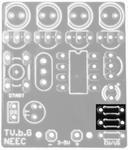

# TVBgone

# Material List

| Components   							|			Quantity		|	Images 		|
|---------------------------------------|---------------------------|---------------|
| Resistência 1kΩ 						|				2			|
<figure></figure>
|
| Resistência 10kΩ						|				1			|
<figure></figure>
|
| Suporte para o circuito integrado		|				1			|
<figure></figure>
|
| Condensador Cerâmico		(0.1F)		|				1			|
<figure></figure>
|
| Condensador eletrolítico (200uF)		|				1			|
<figure></figure>
|
| Switch 								|				1			|
<figure></figure>
|
| Oscilador 	(8Mhz)					|				1			|
<figure></figure>
|
| LED verde 							|				1			|
<figure></figure>
|
| Suporte para pilhas AA				|				1			|
<figure></figure>
|
| Circuito integrado (ATTINY85V-10PU)	|				1			|
<figure></figure>
|
| Transístor PN2907 					|				1			|
<figure></figure>
|
| Transístor PN2222 					|				4			|
<figure></figure>
|
| LED infravermelho 					|				4			|
<figure></figure>
|

# Guia de Montagem

<figure></figure>

1. Soldar as duas resistências de 1kΩ (castanho, preto, vermelho).

<figure></figure>

2. Soldar a resistência de 10kΩ (castanho, preto, laranja).

<figure></figure>

3. Soldar o suporte para o circuito integrado.

**NOTA:** a ranhura do suporte deve corresponder ao desenho impresso na placa.

<figure></figure>

4. Solda os condensadores:
	A: Condensador Cerâmico (pequeno).
	B: Condensador Eletrolítico (grande).

**NOTA:** Deixa alguma margem (≈5mm) entre a placa e a base do condensador eletrolítico para que o possas “deitar” para a direita. Os condensadores eletrolíticos têm polaridade e, portanto, está atento: a “perna” mais comprida tem de ficar junto ao “+”. 

<figure></figure>

5. Soldar o switch e o oscilador.

**NOTA:** Não importa a orientação dos componentes.

<figure></figure>

6. Solda o LED verde. 

**NOTA:** os LED’s têm polarização, e portanto, inserir a “perna” maior junto ao “+”.

<figure></figure>

7. Ligar os cabos do suporte das pilhas, passando-os pelos furos (de baixo para cima).

**NOTA:** vermelho corresponde ao positivo o e preto corresponde ao negativo.

8. Montar o circuito integrado no suporte respetivo e colocar as pilhas. Nesse momento deves conseguir ver o LED verde a piscar.

**NOTA:** a bolinha no canto superior esquerdo do circuito integrado deve coincidir com a ranhura do suporte montado anteriormente.

**ATENÇÃO:** no fim do teste, retira as pilhas para evitar danos nos componentes e prossegue com o workshop.

<figure></figure>

9. Soldar o transístor PN2907.

<figure></figure>

10. Soldar os transístores PN2222.

**NOTA:** os 4 transístores são iguais, por isso, a posição é irrelevante. Contudo, a montagem deve ser feita seguindo o desenho da placa

<figure></figure>

11. Adicionar os LED’s infravermelhos de pernas pintadas na posição indicada. NOTA: deixa uma margem entre a base do LED e a placa, para que o possas inclinar para a frente e tem em conta a polarização (o corte lateral dos LED’s indica a perna negativa).

<figure></figure>

12. Soldar os restantes LED’s infravermelhos.

**NOTA:** tem em conta a polarização do LED.

Testa o teu TV-b-GONE na TV mais próxima para verificar se está tudo a funcionar corretamente, mas já sabes: sê responsável, desliga com moderação.

**BOA SORTE!**

